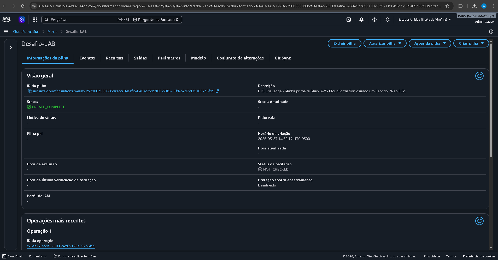
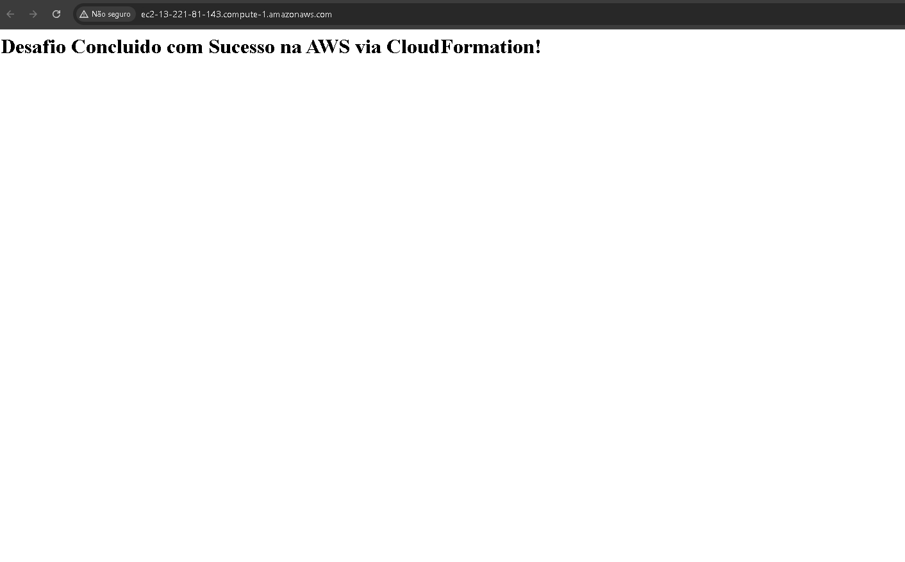

# ☁️ Primeira Stack com AWS CloudFormation - Desafio DIO

Projeto prático para demonstrar a aplicação de **Infraestrutura como Código (IaC)**, automatizando o provisionamento de um servidor web na AWS utilizando o CloudFormation.

## 🎯 Objetivos
- Automatizar a criação de recursos na AWS usando templates `YAML`.
- Provisionar uma instância EC2 rodando o servidor web Apache automaticamente via `UserData`.
- Configurar regras de segurança com Security Group (Portas 80 e 22).

## 🛠️ Tecnologias
- **AWS CloudFormation** & **AWS EC2**
- **Linux (Bash Script)** para automação de boot
- **Git & GitHub** para versionamento

## 📁 Estrutura do Repositório
- `template.yaml`: Código de infraestrutura corrigido e dinâmico (utilizando SSM Parameter Store para buscar a AMI atualizada).

---

## 🚀 Como Executar o Projeto

1. Faça o download do arquivo `template.yaml`.
2. Acesse o console da AWS e vá em **CloudFormation**.
3. Clique em **Create stack** -> *With new resources (standard)*.
4. Faça o upload do arquivo `template.yaml`.
5. Avance as etapas e clique em **Submit**.
6. Após o status `CREATE_COMPLETE`, acesse a aba **Outputs** para pegar a URL pública do servidor.

---

## 📸 Evidências do Sucesso (Prints)

### Stack Criada no CloudFormation

### Servidor Web Online no Navegador

---
💡 *Nota: A infraestrutura foi destruída logo após os testes para evitar custos na conta AWS.*

